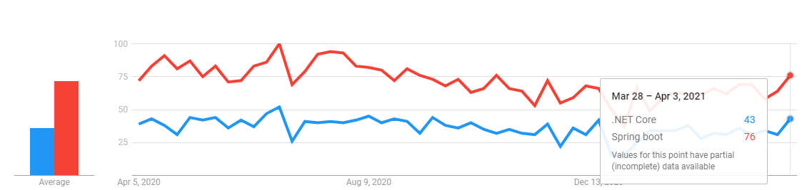
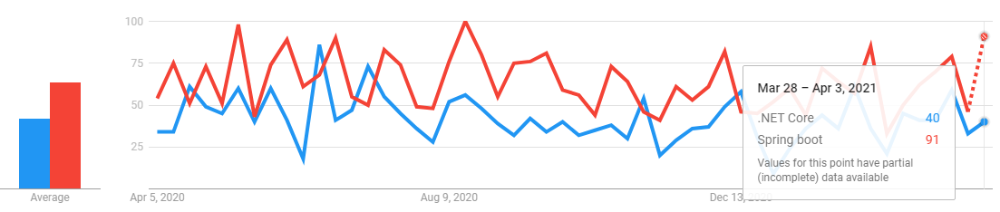

:author: Farsheed Madihi

= .NET Core vs. Spring Boot

== Short comparison between .NET Core and Spring Boot

|===
| | .NET Core | Spring Boot

|Description |Open Source,General-Purpose Development Platform Maintained by Microsoft and the .NET Community|Spring-powered, production-grade applications and services with absolute minimum fuss
| Github stars |15.5K| 54.3K
|Github forks| 3.9K|33.3K
|some popular companies adapted|Catchpoint Systems, Bluebeam Software, and Kaggle|MIT, Intuit, and OpenGov
|mentioned in company stacks |54 |333 
|mentioned in developer stacks|71|617
|===

== The trend comparison between .NET Core and Spring Boot 

The following figures illustrate the google trends in using .NET Core and Spring Boot frameworks in the last 12 months in different counties:

.Worldwide, [red]#Spring Boot# vs. [blue]#.NET Core#

.United States, [red]#Spring Boot# vs. [blue]#.NET Core#

.Germany, [red]#Spring Boot# vs. [blue]#.NET Core#

.Canada, [red]#Spring Boot# vs. [blue]#.NET Core#

.India, [red]#Spring Boot# vs. [blue]#.NET Core#

.Iran, [red]#Spring Boot# vs. [blue]#.NET Core#

== References
1. trends.google.com
2. https://stackshare.io/stackups/dot-net-core-vs-spring-boot
3. https://github.com/spring-projects/spring-boot
4. https://github.com/dotnet/core